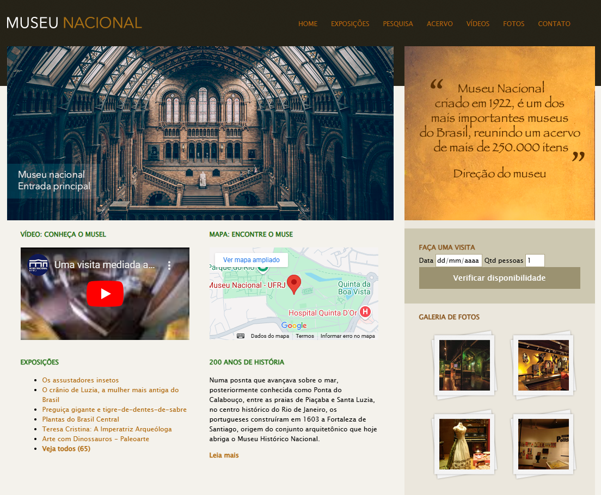
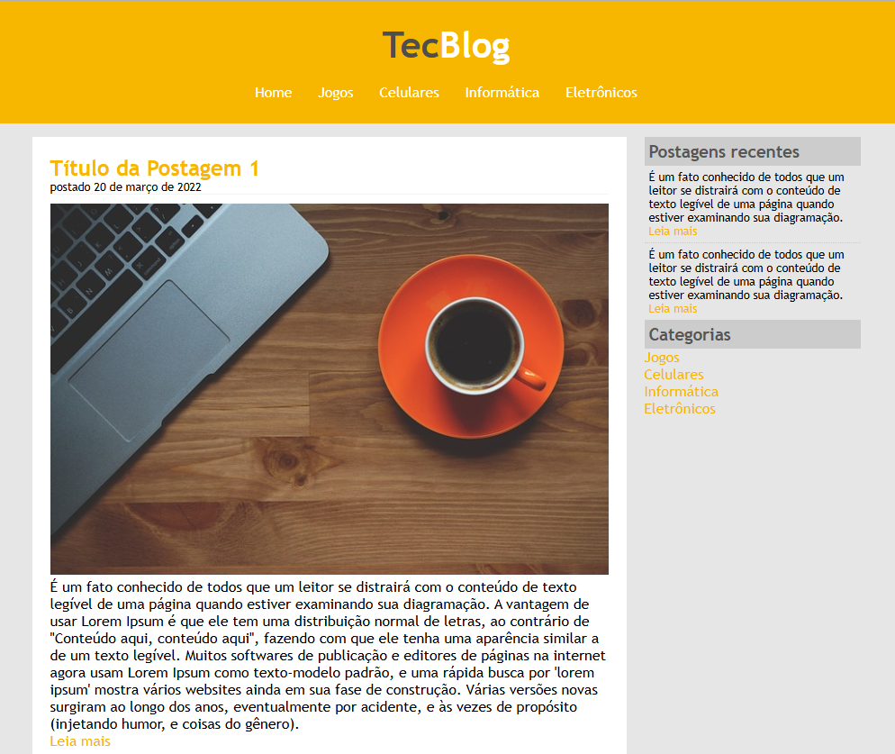
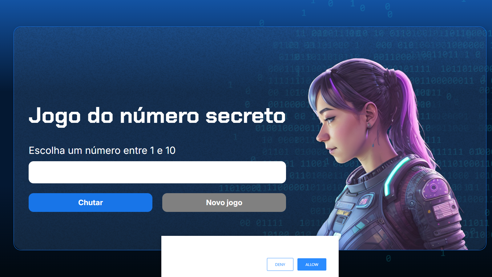

# Portfólio de Damaris França

Bem-vindo ao meu portfólio! Este projeto apresenta minhas habilidades e projetos como desenvolvedora front-end. Aqui, você encontrará informações sobre mim, meus projetos e como entrar em contato.

## Índice

- [Sobre Mim](#sobre-mim)
- [Tecnologias Utilizadas](#tecnologias-utilizadas)
- [Projetos](#projetos)
- [Como Acessar](#como-acessar)
- [Contato](#contato)
- [Licença](#licença)

## Sobre Mim

Sou estudante de Análise de Sistemas, apaixonada por criar interfaces intuitivas e visualmente atraentes. Com foco em desenvolvimento Front-end, estou sempre buscando novas tecnologias e aprimorando minhas habilidades em HTML, CSS e JavaScript. Atualmente, estou estudando React e explorando projetos pessoais.

## Tecnologias Utilizadas

- HTML
- CSS
- JavaScript
- Bootstrap
- React (em aprendizado)

## Projetos

Aqui estão alguns dos projetos que desenvolvi:

1. **[Museu Nacional](https://damarisjs.github.io/Musel-Nacional/)**: Um site interativo que apresenta informações sobre o Museu Nacional.
   

2. **[TecBlog](https://damarisjs.github.io/TecBlog/)**: Um blog de tecnologia onde compartilho artigos e tutoriais.
   

3. **[Efeito Parallax](https://damarisjs.github.io/Efeito-Parallax/)**: Um projeto que demonstra o efeito parallax em uma página web.
   

4. **[Número Secreto](https://damarisjs.github.io/numero-secreto/)**: Um jogo simples onde o usuário tenta adivinhar um número gerado aleatoriamente.
   

## Como Acessar

Para visualizar meu portfólio, você pode acessar o seguinte link: [Portfólio Damaris França](http://seu-link-aqui.com).

## Contato

Se você deseja entrar em contato, pode me encontrar nas seguintes redes sociais:

- [Instagram](https://www.instagram.com/damaris_rfranca/)
- [LinkedIn](https://www.linkedin.com/in/damarisrmfran%C3%A7a/)
- [GitHub](https://github.com/DamarisJs)

Você também pode me enviar um e-mail para: [damarisfrancaribeiro@hotmail.com](mailto:damarisfrancaribeiro@hotmail.com).

## Licença

Este projeto está licenciado sob a [MIT License](LICENSE).

---

Agradeço por visitar meu portfólio! Estou sempre aberta a feedbacks e oportunidades de colaboração.
